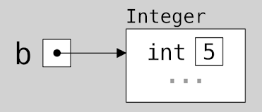
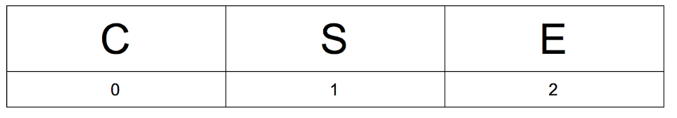
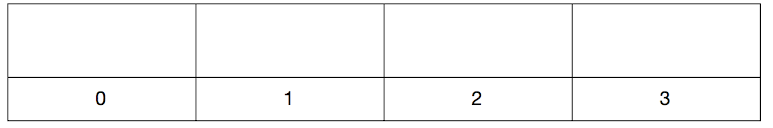
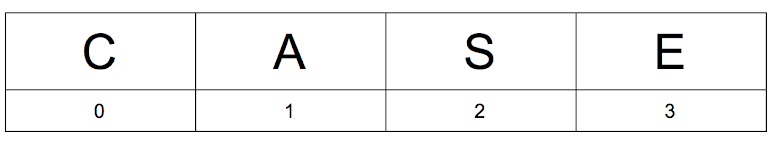
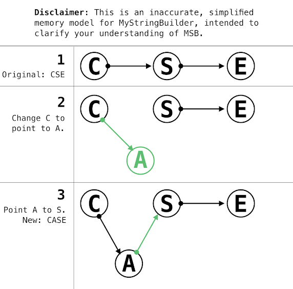
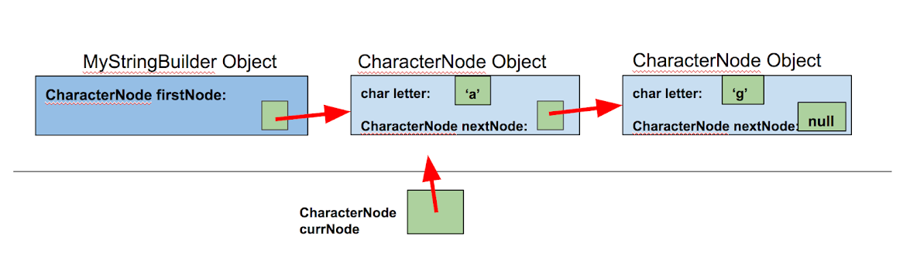
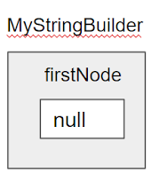
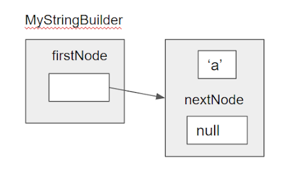
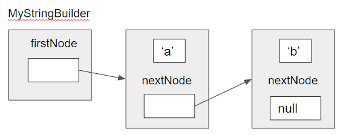
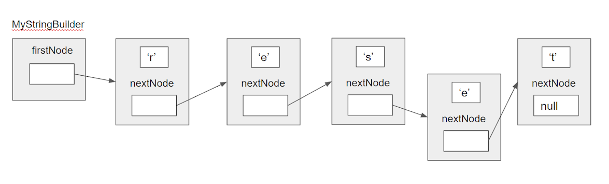

# PSA 7: MyStringBuilder
This PSA is due Dec 4, Wednesday, 11:59pm

## Introduction
In this PA, we will explore concepts relevant to Data Structures which you might see in CSE 12.  You will also learn more about pointers and references, and their application.

## Starter Code
Copy the starter code using the same command as in the previous PSAs (refer to PSA 0 if you need a refresher). The starter code is located at the following path:
```
~/../public/psa8
```
Backup your code as you progress through the assignment. Remember that Gradescope can serve as storage for your code! Start early, submit often.

### Java Pointers and References
Recall memory model diagrams and the NullPointerException. When a variable is null, the diagram will not have an arrow. When a variable “points to an object” or “has a reference”, then it points to an object.

 | 

In __*Java specifically*__ , “pointers” and “references” are interchangeable. It will no longer be clear enough for us to speak about “variables”. In this assignment, we will use the word **pointer**. Why? **To get used to the idea of having pointers pointing to objects**. 
A __**null**__ **pointer** does not point to any object, and so when you call `null_pointer.any_variable` or `null_pointer.any_method()`, Java throws a NullPointerException. A pointer of class Object points to an instance in memory of that Object.

## MyStringBuilder
Strings are implemented differently across different programming languages. In Java, Strings are actual Objects! Furthermore, we have multiple classes which implement sequences of characters in varying ways (char arrays, ArrayLists of Characters, Strings, StringBuilder). These all have similar capabilities with different implementations internally. Here, we now explore one internal implementation by writing a simple string data structure. While it is similar to __the StringBuilder__ class, the internal workings of our StringBuilder will be one we have not seen before. We will call it **MyStringBuilder** to differentiate it from the default Java implementation.

The MyStringBuilder will be used to construct, store, and modify characters in a specific order. Before we talk about how our MyStringBuilder will be implemented, let’s pretend we were using a char array (we won’t use an actual char array in this assignment). In memory, elements of an array are stored next to each other like this:



Suppose we made a mistake with “CSE” and we meant to spell “CASE”. The char array would have {‘C’, ‘S’, ‘E’}. To fix our mistake, we would have to (1) create a new array, (2) move ‘S’ and ‘E’ back, and then (3) assign the letter ‘A’ to position 1. 

1. Create a new array:


2. & 3.  Copy items and add A:


This is inefficient and slow. If the array we are copying is very long, this could take a very long time! In MyStringBuilder, we will instead use **pointers** to link different letters together. CSE will be represented as `C → S → E`. Let’s think about how we could insert the letter ‘A’ into our MyStringBuilder now.



Nice! We didn’t have to remake our entire MyStringBuilder and copy all of its contents!

But, char is a primitive type and not an Object-subclassed type. Primitive types don’t have the ability to point to each other. To solve this issue, we will contain the char inside a class whose sole purpose is to hold __chars__ and __pointers to the next char__ in the sequence. We will call this class a ***node***.

Below is a memory model diagram to provide a visual context for the following methods. The light and dark blue boxes represent objects while the green boxes represent the actual value. The red arrows represent pointers. Remember that pointers are simply **memory addresses**. In order to access elements, Java **automatically** follows the pointer to the actual object. 

**Note**: The diagrams in this writeup are not accurate representations, they are just for you to get a better sense of what is happening - we encourage you to draw your own accurate diagrams/memory models to visualize the logic behind the algorithms. We will omit the end pointer of the MyStringBuilder and name things in the diagrams such that they are more descriptive for our uses (`firstNode` for `start`, `nextNode` for `next`, `letter` for `data`, etc.). 



This MyStringBuilder has the word “ag”. Notice that the chars are **not actually inside** **MyStringBuilder** - MyStringBuilder has a pointer which points to the first node, which contains information of a char ‘a’. The first node also points to another node, which contains information of another char ‘g’. 
Note that `start`, `end`, and `next` are simply instance variables of type `CharNode` - we’ve seen this countless times in previous PSAs. They’re pointers to other objects. We can use these to join all of the CharNodes together.
Upon finishing the implementation of MyStringBuilder, the data structure should be able to store infinitely many characters (theoretically). 
You might need to iterate through your MyStringBuilder in order to add and delete characters. To “iterate” through a MyStringBuilder, you need a way to keep track of where your current position. This will be done using an additional CharNode pointer (i.e. the `currNode` pointer in the figure above). Notice the two pointers pointing to the first CharNode. 

### Java Language Details
***The Java garbage collector will delete all Objects that no longer have any pointer pointing to it***.

If you unintentionally lose the only pointer of a CharNode, you will lose that CharNode and ALL subsequent nodes to the Java garbage collector! (On the flip side, the way to intentionally delete a Node is to do some type of pointer rerouting such that a certain Object has zero pointers pointing to it…)

### Policies
All instance variables given in the starter code must be unchanged (do not change the names or access modifiers). **Use of libraries and other data structures of any kind in this part to store your MyStringBuilder content will result in a zero**. For example, you can’t use a Java StringBuilder to make your MyStringBuilder. Don’t use character arrays, Strings, etc. You **are** allowed to use String's `charAt()`, `substring()`, and `length()` instance methods (you shouldn't need anything else anyway). If you're using CharNodes as specified in the writeup, you're fine. All code must be from scratch (other than given starter code) and the logic must use only pointers, object instantiation, and object initialization.

## Exception Handling
In this PA, you will be required to handle different exceptions using **try** and **catch** blocks in your methods. An exception is characterized as anything that disrupts the normal flow of the method. Some examples of different exceptions include NullPointerException, ArithmeticException and IndexOutOfBoundsException. 
You should enclose the part of your code that might cause the error in your try block. In your catch block, make sure you are catching the appropriate exception. You should then throw this exception using the throws keyword. 
Let's take a method attempting to divide by 0 as an example. To handle the exception in the method, you would do the following:
```java
public static void divideByZero() throws ArithmeticException {
  try {
   System.out.println (39/0);
  }
  catch (ArithmeticException e) {
   System.out.println ("Exception caught!");
   throw e;
  }
}
```

## MyException.java and and Its Subclasses
In the starter code, you are provided with three files: **MyException.java**, **MSBOutofBoundsException.java** and **BadInputException.java**. Make sure you read through each of the files before starting the assignment. 

### MyException.java
This class extends `Throwable`, which is the superclass of all errors and exceptions. Any MyException object can be thrown using the `throws` keyword, similar to what was shown in the example above.
The constructor takes in two String objects, the first specifying where the MyException object is getting thrown **from** (which method is causing the error), and the second specifying a **message** used to describe the error. 
- There are constants defined in the starter code of your MyStringBuilder.java file, which you should pass in as arguments when creating new instances of MyException objects.

### MSBOutOfBoundsException.java
This class extends MyException.java. It should be thrown when your MSB object faces an out of bounds error. The object has a static instance variable, `count`, which is incremented each time a new MSBOutOfBoundsException object is created. Note that the variable is static, meaning that it is shared across all instances of the class. 

### BadInputException.java
This class also extends MyException.java. It should be thrown when the input into the MSB object is of an unintended type (such as a null object). Like the MSBOutOfBoundsException class, this class also has a static `count` variable, which has the same functionality as listed above.

### The Constructors
You will notice that the constructors for these exceptions takes a `from` String and a `message` String. Use the provided String literals in MyStringBuilder.java for the `from` argument and use whatever will help you debug as the `message` argument. 

## Part 1: Main.java

Note: Using this will be very helpful for your testing. Some people find it easier to implement this file before writing the actual code from MyStringBuilder.java (by calling the appropriate methods from MyStringBuilder in good faith) while others find it easier to implement this as they implement each method from MyStringBuilder. For your reference, we (the pa development team) are part of the latter group. 
This file is the driver used to implement your MyStringBuilder object. When you run Main.java, you can enter a series of commands, each of which will test a specific method that you are intended to write (as listed below). The commands are: 

* C - choose a word from the internal list of MyStringBuilder objects
* X - construct a new MyStringBuilder object
* A - append to the current MyStringBuilder
* I - Insert into the current MyStringBuilder
* P - Print the current MyStringBuilder
* R - Remove a character from the current MyStringBuilder
* D - Delete part of the current MyStringBuilder
* L - List all MyStringBuilders
* O - Concatenate two MyStringBuilders
* E - Reverse the current MyStringBuilder
* M - Remove the current MyStringBuilder
* Q - Quit

The program works as follows:

1. The constructor initializes an empty ArrayList of **MyStringBuilder** objects. 
2. The user will first be prompted to construct a new MyStringBuilder object. 
3. While the input is not 'Q', the user will continuously be asked to enter a command from any of the options listed above.
4. When the user finally enters 'Q', the total number of MSBOutOfBoundsException and BadInputException will be printed to the console.

You can also run the program using `java Main test.txt` where `test.txt` (doesn't have to be that name) is some file with the sequential inputs you want to use (make sure to hit enter after each command when creating this file). If you don't include 'q' as a command in the file, then you will be able to continue entering commands after all the commands from the file are read. 

### Part A: Main.java's readInput()

Familiarize yourself with the provided parts of **Main.java** before proceeding. 
The only thing you need to do for this portion is fill in the switch statement in `readInput()`. There are 17 (15 for the regular assignment and the last two for the extra credit) format String constants provided to you (you can review how to use them from __this documentation__), each is used exactly once and they should all be used in order. Recall that `%s` represents that there will be a string there and `%d` represents that there will be an integer there. You should read each String to decide when and where they should be used. **For any String that prompts the user for an input, make sure** to use `System.out.print()` which will not print the new line at the end like `System.out.println()` does. For any result strings, use the regular `System.out.println()`. 

We have provided some fully-implemented helper methods for you called `list()`, `printCurrWord()`, `removed()`, and `switchTo()`. Make sure you call the appropriate methods in each of the switch cases with the appropriate user input. 

**You must implement the following 11 (+1 if you do EC) cases:**

1. `case CHANGE`: 
This should change which MyStringBuilder object we are currently modifying. First, we will list all the current MyStringBuilder objects using `list()` and prompt the user using `FMT_1`. Then, we will take whatever integer the user typed and pass it into `switchTo()`. 

2. `case CONSTRUCT`: 
This handles creating a new MyStringBuilder object. First, prompt the user using `FMT_2`. We should read the user's input and **try** to add a new MyStringBuilder based on the user's input to the end of the `words`. If successful, we can print `FMT_3` with the newly added MyStringBuilder and update `currInd` to the newly added MyStringBuilder's index. If the add is unsuccessful, we should print the error that we catch (using its `toString()`). 

3. `case APPEND`: 
This handles adding onto the current MyStringBuilder object. First, prompt the user using `FMT_4`. Attempt to append the user's input to the current MyStringBuilder (marked by `currInd`). If successful, print `FMT_5` with the appended string. If not, print the appropriately caught exception. 

4. `case INSERT`: 
This handles inserting a string into our current MyStringBuilder object. First, prompt the user using `FMT_6`. This input will be the string that we insert. Next, prompt the user using `FMT_7`. This will be the index at which we insert the string. Attempt to insert the string at the index. If successful, print `FMT_8` with the inserted string and insertion index. If not, print the appropriately caught exception. 

5. `case PRINT`: 
This will simply print the current MyStringBuilder using `FMT_9`.

6. `case REMOVE`: 
This handles removing a single character from the current MyStringBuilder. Prompt the user using `FMT_10`. The user's input will be the index of the current MyStringBuilder that we will remove. If successful, print `FMT_11` with the index that was removed. If not, print the appropriately caught exception. 

7. `case LIST`: 
We can simply use the provided `list()` and break. 

8. `case DELETE`: 
This handles deleting a substring from the current MyStringBuilder. Prompt the user using `FMT_12`. The user's input here will be the starting (inclusive) index of the delete. Next, prompt the user using `FMT_13`. The user's input here will be the ending (exclusive) index of the delete. Attempt the delete on the current MyStringBuilder. If successful, print `FMT_14` with the user-inputted start and end indices. If not, print the appropriately caught exception. 

9. `case CONCAT`: 
This case requires no further user input. It will simply concatenate the current MyStringBuilder with the next one (the one at `currInd+1`). If there is no next MyStringBuilder, it should concatenate with null. Attempt the concatenation. If successful, the next MyStringBuilder should be removed from words (but don't call `removed()`) and you should print `FMT_15` (the first index is `currInd+1` and the second is `currInd`). If unsuccessful, print the appropriately caught exception.

10. `case DESTRUCT`: 
This case will "destroy" the current MyStringBuilder. Remember that we can just use Java's garbage collector. Therefore, we need only remove the current index from words and call `removed()`, passing in whatever MyStringBuilder we just removed. 

11. `case QUIT`: 
This case should just set `quit` to `true`, which will tell our while loop to stop. 

(**Optional** __**Extra Credit**__)

12. `case REVERSE`: 
This is for the extra credit. First, prompt the user using `FMT_16`. Call `reverse()` on the current MyStringBuilder based on the user's input (use the provided `RECURSIVE` and `ITERATIVE` constants for this). If the user's input (case-sensitive this time) does not match either, print `FMT_17`.

## Part 2 Defining our two Classes

## Part A: MyStringBuilder
`public class MyStringBuilder`

Our custom MyStringBuilder class will have 
* Three constructors 
  * the first constructor takes a char input and should create a MyStringBuilder with the single CharNode representing the input
  * the second constructor creates a MyStringBuilder from some String. If the String is null, nothing should be created. If the String is empty, then the constructed MyStringBuilder object should also be empty (have no CharNodes). **Hint**: You should use the `append()` method of Part C for this. **Note**: This constructor throws `BadInputException`. If you use `append`(), it will be thrown from there, otherwise you should throw it for the same reason (what kind of input is this constructor's behavior not defined for?). 
  * the third constructor constructs a MyStringBuilder using a CharNode. We will simply do a shallow copy since it will not affect our functionality but deep copying is not so easy. Since CharNodes store their proceeding nodes inside themselves, we should follow this chain until we get to the end and construct our MyStringBuilder object to match. 
* three instance variables: 
  * a pointer to our first node (a CharNode). 
  * a pointer to our last node (a CharNode). 
  * the length (number of CharNodes) in the current MyStringBuilder

### CharNode
`public class CharNode`
This class/file is provided to you and contains:
* a private final char type named `data`, and 
* a private CharNode pointer named `next`. 
* one and only public constructor. This takes in one parameter: a char, initializing the instance char letter. It leaves the `next` pointer as null.  **We will not allow a no-argument constructor to exist**. 
**We now see one reason why Java allows null pointers**. `next` **is null if and only if it is the last character, and** `next` **cannot be null if it is not the last node. Refer to the diagram again.**
* Both the instance variables are private, so we must use getters and setters to access them. Read through this file and familiarize yourself with the provided methods, as you will use them a lot. 

## Part B: Output the Length
### length()
**`public int length()`**

It is useful to know the data structure’s size. One implementation of this would just have us traverse through each node, counting them. However, this is pretty inefficient to do this every time we want to know the length. Therefore, we have the `length` instance variable that will keep track of all changes to the length from other methods. You can therefore directly return the value from that instance variable for this method. 

**Note**: Your other methods must appropriately update the `length` variable each time. 

## Part C: Append
Time to start adding functionality to our MyStringBuilder!
### append()
**`public MyStringBuilder append(char c)`**

This is a helper method used to append a single char to the end of MyStringBuilder. It should be used by the method below, to append an entire string to MyStringBuilder.
* If MyStringBuilder is empty, then `start` and `end` must point to a new CharNode containing this char. 
* Otherwise, use the MyStringBuilder object's end. Recall that the last node’s `next` pointer is __always__ null. 
You will make the previously last node point at a newly created CharNode containing `c`. Remember to update the instance variables. If you skipped the second MyStringBuilder constructor, you should revisit it now. 
A fresh MyStringBuilder object `msb`, in a diagram:
* **NOTE**: In the following, diagram, and those in the remainder of the writeup, the instance variable start will be referred to as *firstNode*, and `next` will be referred to as *nextNode*, to highlight that these are node objects.



if we call `msb.append('a')`, then: 



Afterwards if we call `msb.append(‘b’)`, then:



**HINT**: You must “remember” where you are as you iterate through the nodes.  

**`public MyStringBuilder append (String str) throws BadInputException`**

This method should append an entire string to the end of your current MyStringBuilder object. It should then return your new MyStringBuilder object. 
* If the string is empty, nothing should be added to MyStringBuilder.
**This method requires exception handling**. Look at the method header, which throws a BadInputException. What kind of input would you need to handle using this exception (what kind of input is the behavior of this method not defined for)?

## Part D: Output as a String
### toString()
**`public String toString()`**

Since the MSB class is a way to manipulate and store Strings, we should have a `toString()` method which returns an actual `String` object of our stored String. This function accomplishes that goal. Yet, what we currently have is not a char array or a String, but a sequence of nodes of chars. This function takes this sequence of CharNodes and turns the sequence of chars into a `String`. The logic should be similar to the `append()` method, but instead of inserting a character we are simply reading through each character we already have.

### Test Your Code 
It might be a good idea to stop now and test your append and `toString()` methods. You can run `Main.java` and try appending a few different Strings. Try to append single characters and complete Strings. Are there any exceptions when you run it? Does toString return the correct String? If not, go back to your code and trace through your logic. It helps greatly to draw a memory model diagram of your MyStringBuilder as you trace through your code.

## Part E: Insert
## insert()
**`public MyStringBuilder insert (char c, int index) throws MSBOutOfBoundsException`**

This is a helper method that will be used to insert an entire String at a specified index. The method should work as follows:

The `index` is the position in our sequence of nodes where we want to insert a char. Once finished, `c` will have position `index`. The previous node at position `index` will be at position `index + 1`. In fact, all nodes whose positions were `index` or higher will have their positions incremented. Remember to update the instance variables. 

For example, you have a string “rest” and call `insert('e', 3)` on this string. Before `insert()` was called, the letter ‘t’ was at position 3. Now, ‘e’ is at position 3 while ‘t’ is at position 4, resulting in the string “reset”. Note that the node containing ‘s’ must point to a different node now.

Before `insert()`:


After `insert()`:



**Exception Handling:** 
* `insert` must be non-negative (0 is not negative) and less than or equal to the length of the sequence. Make sure you handle any invalid input accordingly (by throwing the appropriate exception). (Notice that it is fine if index is equal to the length of the sequence. What does this mean?)

**`public MyStringBuilder insert (String str, int index) throws BadInputException, MSBOutOfBoundsException`**

This method should be similar to your `append()` method. `index` should represent the position in MyStringBuilder where the first character of the `str` should start. You will need to handle invalid input for both the `index` and `str` parameter. Make sure you're throwing the correct exception for each problem. Remember to update `length`. 

**Hint**: You might find using your other **insert()** method (the one that takes a char) as a useful subroutine. (It might also be very intuitive for you to implement this String one with recursion, it is fine if the recursive way is not as efficient.) If you use the other method as a subroutine, you don't need to catch any exception it throws. 

## Part F: Find Character at Index

**`protected CharNode findIndexFrom (CharNode cNode, int index) throws MSBOutOfBoundsException`**

This is a helper method to find the character at a given index. It takes in a CharNode, which should be used as an iterator in MyStringBuilder, until `index` from `cNode` is reached. For example, if `cNode` is the 5th node and `index` is 5, then we want to return the 10th node. 
* if `index` is 0, then `cNode` should be returned
* `index` should be non-negative, and `index` from `cNode` should be in the MyStringBuilder (i.e. `length` should be greater than `cNode`'s position + `index`). Be sure to handle any exceptions accordingly.
  * **NOTE** - If MyStringBuilder is empty, then any value of `index` would be out of bounds. 

**`protected CharNode findIndex (int index) throws MSBOutOfBoundsException`**

This method should use the above helper function, to return the character at the given index. 
* If `findIndexFrom()` throws an exception, then this should be caught from `findIndex()` and re-thrown with a new "from".

## Part G: Remove a Char 
### remove()
**`public MyStringBuilder remove (int index) throws MSBOutOfBoundsException`**

This method should remove the CharNode at a given index. Like in `insert()`, index represents the position of the node which we want to remove. After this node is removed, the previous node at position `index + 1` should be at position `index`. Remember to update the instance variables.
* `index` should be **non-negative** and within the length of MyStringBuilder. Make sure you handle any exceptions appropriately.

## Part H: Delete a Range of Chars
### delete()
**`public MyStringBuilder delete (int startIndex) throws MSBOutOfBoundsException`**

This is a method used to delete a range of characters. `startIndex` specifies an index in MyStringBuilder. All nodes starting from and including `startIndex` should be removed from MyStringBuilder. Remember to update the instance variables. 
After delete, the node at `startIndex - 1` should now point to null as its next node.
* The parameter `startIndex` must be nonnegative, and within the bounds of MyStringBuilder.

**`public MyStringBuilder delete (int startIndex, int endIndex) throws BadInputException, MSBOutOfBoundsException`**

This method deletes a subsequence of characters from MyStringBuilder. (Deleting the entire sequence is also considered deleting a subsequence.) See the **Java Language Details** (at the top of this page) deleting Java objects. The nodes for deletion starts at position startIndex and deletes up to, but not including, the node at position `endIndex`.

* If `startIndex == endIndex`, then nothing is deleted. 
* `startIndex` must be within the bounds of MyStringBuilder and non-negative, `endIndex` must be less than or equal to the length of MyStringBuilder. If these are not true, throw an `MSBOutOfBoundsException`. Notice that `endIndex` is allowed to be equal to the length of this MyStringBuilder. What should happen in this case? 
* If `endIndex` is less than `startIndex` throw a `BadInputException`. 

### Examples
Consider the string “abc”. 
* `delete(1,1)` does nothing.
* `delete(1, 2)` will delete ‘b’ and cause the node containing ‘a’ to point at the node containing ‘c’.
* `delete(0, length())`  will delete the whole sequence. When in doubt, draw it out!

## Part I: Concat two MSB Objects
### concat()
**`public MyStringBuilder concat(MyStringBuilder rightOperand) throws BadInputException`**

This method concatenates two MSB objects together. `rightOperand` represents the MSB Object that should be the second part of the current MSB object. Remember to update the instance variables. 
* If your current MSB object's length is 0, then your current MSB object will start with the same start node as `rightOperand`. Therefore, it will have the same `start`, `end` and `length` variables as `rightOperand`.
* If `rightOperand` is not a valid input, you need to throw a `BadInputException`.

We now have a working MyStringBuilder! This allows us to manipulate sequences of characters as we please. Make sure to test out your implementation, and then pat yourself on the back.

## Extra Credit: 
### Iterative and recursive reversal
You are **not allowed** to ask on Piazza or at office/lab hours how to implement these. You can only ask for clarification. 
The following three (3) methods should be implemented in MyStringBuilder.java:
1. `public MyStringBuilder reverse(boolean recursive)`  
2. `protected MyStringBuilder reverseRecursive(CharNode startNode, CharNode prevNode)`  
3. `protected MyStringBuilder reverseIterative()` 
You will also need to add a new case to your switch statement in **Main.java**'s `readInput()`, which you should add right above the default.

`case REVERSE`: 

Other methods are not necessary, but feel free to implement them recursively too if you want the practice. Feel free to use any helper methods you want (keep any helper methods private). Do not change the above three method signatures.

`public MyStringBuilder reverse(boolean recursive)`

This method should call the recursive reverse if `recursive == true` and the iterative reverse if `recursive == false.` 

`protected MyStringBuilder reverseRecursive(CharNode startNode, CharNode prevNode)`

You can use the two parameters in whatever way you wish, as long as you recursively call this method. 

`protected MyStringBuilder reverseIterative()`

This method should iterate through the entire object reversing each pointer. 

## `README.md`

### CAPE
Fill out your [CAPE review](http://www.cape.ucsd.edu/)! You don't need to submit proof, just note in your README that you submitted it. 

### Program Description
Include a brief, high-level program description in 3-5 sentences. Don’t use any technical CS terms, but make sure to describe the functionality of your program.

### Pointer Questions
1. In your own words, what are the benefits of the way we used pointers to build MyStringBuilder?
2. Suppose I wanted to reuse the nodes that have the same characters. Assuming I only have capital letters as characters, that would mean I have at most 26 nodes at once. How would you modify the way the CharNodes used pointers to allow this to happen? Consider the case where I have a word like CHEESE. There would be one node with the letter E in it. How would you know to go from E to E, then from E to S, then stop at E?

### Exception Handling
3. In Main.java's ``readInput()``, you either caught exceptions 1) specifically with BadInputException and MSBOutOfBoundsException or 2) caught both at once with MyException. Explain the pros and cons of each 1) and 2) and explain why you picked the method you did. 

## Style
Just as the last PSA, we will grade your code style more thoroughly. Namely, there are a few things you must have in each file / class / method:

1. File header
2. Class header
3. Method header(s)
4. Inline comments 
5. Proper indentation
6. Descriptive variable names
7. No magic numbers (define all magic numbers as **private static final** constants). A magic number is any value that is not -1, 0, or 1. This includes Strings and chars as well.
8. Reasonably short methods (if you have implemented each method according to specification in this write-up, you’re fine).
9. Lines shorter than 80 chars (keep in mind each tab is equivalent to 8 spaces)
10. Javadoc conventions (@param, @return tags, /* block comments */, etc.)
A full style guideline can be found here:

https://sites.google.com/eng.ucsd.edu/cse-8b/programming-assignments/style-guidelines

## Submission
### Submit the following files to Gradescope by Dec 4, Wednesday, 11:59pm:
* **Main.java**
* **MyStringBuilder.java**
* **`README.md`**

**Well done!**
**With that, we have wrapped up the last assignment in Intro to Computer Science: Java I & II.**
**Congratulations for completing these courses’ assignments and good luck in your future ventures!**
